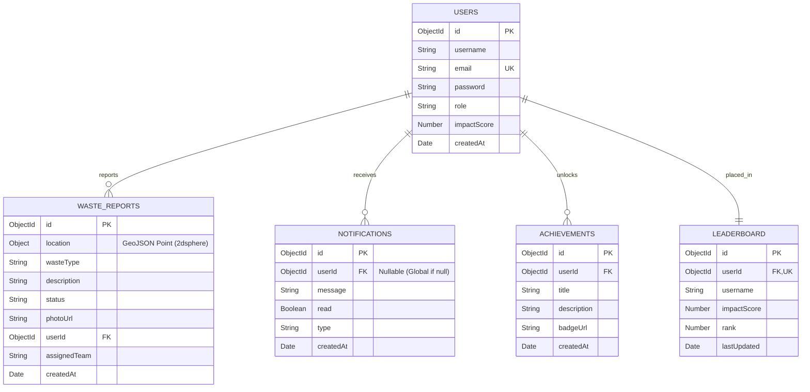

# 🌍 AI-Powered Smart Waste Mapping Platform

Welcome to the **Smart Waste Mapping Platform**, a community-driven, gamified web application designed to help citizens and municipalities collaborate on keeping their cities clean. This platform allows users to report waste hotspots, track cleanup efforts, and earn "Eco Points" that can be redeemed for sustainable rewards.

🔗 **Live Website:** [https://ai-powered-smart-waste-mapping-plat.vercel.app](https://ai-powered-smart-waste-mapping-plat.vercel.app)

🔑 **Demo Credentials:**
* **Admin Account:**
  * Email: `vijayapandian112007@gmail.com`
  * Password: `123456`
* **User Account:**
  * Email: `vijayapandiant07@gmail.com`
  * Password: `123456`


---

## ✨ Key Features

- 📍 **Interactive Waste Mapping:** View and report waste on a real-time, interactive city map.
- 📸 **Rich Reporting:** Users can upload photos, describe the waste type, and log precise GPS coordinates.
- 🏆 **Gamified Eco-Points System:** Earn XP by reporting waste and volunteering for cleanups. 
- 🛒 **Eco Reward Marketplace:** Redeem your hard-earned Eco Points for real-world sustainability rewards (like transit passes or tree planting).
- 📅 **Community Cleanups Hub:** Schedule, discover, and volunteer for local street and beach cleanups.
- 🏅 **Live Leaderboards:** Compete with other eco-warriors in your region to become the top contributor.
- 🔔 **Real-Time Notifications:** Stay updated instantly when your reported waste is collected or when you earn a new badge.
- 🛡️ **Admin Dashboard:** Powerful tools for municipal workers to track hotspots, manage reports, and organize events.

## 🌟 Unique Features

- **🤖 AI-Powered Waste & Risk Prediction:** Employs a Machine Learning model (Random Forest Regressor) to predict waste volume (in tons) and risk level based on coordinates, population density, and complaint counts.
- **🛣️ Intelligent Route Optimization:** Solves routing for utility trucks using a nearest-neighbor shortest path solver, calculating estimated transit times and fuel saved to reduce emissions.
- **📍 Geographic Hotspot Clustering:** Automatically groups multi-report zones into density-based hotspots and scales their localized risk level.
- **🏷️ Automated Priority Classification:** Audits report text to automatically tag priority (Low, Medium, High) and flag hazardous or pathway-blocking incidents.

## 💻 Tech Stack

This project is built using the **MERN** stack alongside modern frontend tooling:

**Frontend:**
- React 18 (Vite)
- Tailwind CSS (Dark-mode Glassmorphism UI)
- Lucide React (Icons)
- React Router (Routing)
- Leaflet / React-Leaflet (Interactive Maps)
- Axios (API Client)

**Backend:**
- Node.js & Express.js
- MongoDB & Mongoose
- JSON Web Tokens (JWT Authentication)
- Socket.io (Real-time WebSockets)
- Multer & Cloudinary (Image Uploads)

## 🗄️ Database Schema

Below is the Entity Relationship (ER) Diagram of the database schema, detailing the collections and their relationships:



For a detailed explanation of indexes, validation constraints, and other design considerations, please refer to the [database_schema.md](file:///c:/1M1B/AI-Powered-Smart-Waste-Mapping-Platform/docs/database_schema.md) file.

## 🚀 Getting Started

Follow these instructions to get a copy of the project up and running on your local machine.

### Prerequisites

Ensure you have the following installed:
- Node.js (v16 or higher)
- MongoDB (Local instance or MongoDB Atlas cluster)
- Git

### Installation

1. **Clone the repository:**
   ```bash
   git clone https://github.com/VIJAYAPANDIANT/AI-Powered-Smart-Waste-Mapping-Platform.git
   cd AI-Powered-Smart-Waste-Mapping-Platform
   ```

2. **Install Backend Dependencies:**
   ```bash
   cd backend
   npm install
   ```

3. **Install Frontend Dependencies:**
   ```bash
   cd ../frontend
   npm install
   ```

### Configuration

1. **Backend Environment Variables:**
   Create a `.env` file in the `backend` directory with the following variables:
   ```env
   PORT=3000
   MONGO_URI=your_mongodb_connection_string
   JWT_SECRET=your_super_secret_key
   CLOUDINARY_CLOUD_NAME=your_cloudinary_name
   CLOUDINARY_API_KEY=your_cloudinary_key
   CLOUDINARY_API_SECRET=your_cloudinary_secret
   ```

2. **Frontend Environment Variables:**
   Create a `.env` file in the `frontend` directory:
   ```env
   VITE_API_URL=http://localhost:3000/api
   VITE_SOCKET_URL=http://localhost:3000
   ```

### Running the Application

To run the application locally, you will need two terminal windows:

**Terminal 1 (Backend Server):**
```bash
cd backend
npm run dev
```

**Terminal 2 (Frontend Client):**
```bash
cd frontend
npm run dev
```

Your app will now be running on `http://localhost:5173`.

---

## 🤝 Contributing

We welcome contributions from the community to help build cleaner, smarter cities! 
1. Fork the Project
2. Create your Feature Branch (`git checkout -b feature/AmazingFeature`)
3. Commit your Changes (`git commit -m 'Add some AmazingFeature'`)
4. Push to the Branch (`git push origin feature/AmazingFeature`)
5. Open a Pull Request

## 📄 License

This project is licensed under the MIT License - see the LICENSE file for details.

---
*Building Clean Smart Cities together.* 🌱
