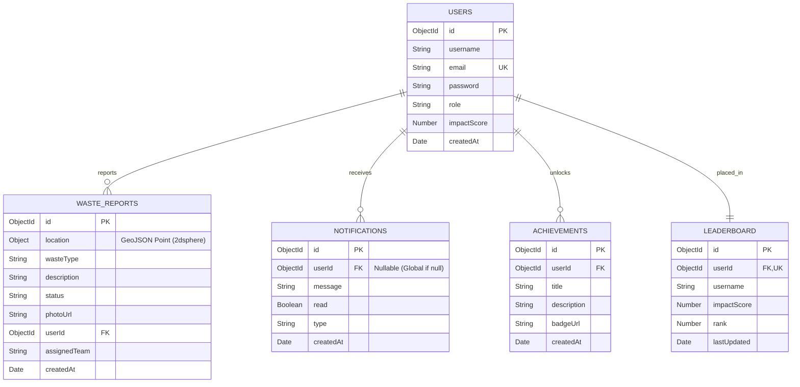

# 🌍 AI-Powered Smart Waste Mapping Platform

Welcome to the **Smart Waste Mapping Platform**, a community-driven, gamified web application designed to help citizens and municipalities collaborate on keeping their cities clean. This platform allows users to report waste hotspots, track cleanup efforts, and earn "Eco Points" that can be redeemed for sustainable rewards.

<p align="center">
  <a href="https://ai-powered-smart-waste-mapping-plat.vercel.app">
    
  </a>
  &nbsp;&nbsp;
  
  
  
</p>

---

> [!IMPORTANT]
> ### 🔑 Live Demo Credentials
> Use the accounts below to explore both the citizen and administrative sides of the dashboard:
>
> | Role | Email | Password |
> | :--- | :--- | :--- |
> | **Admin Account** | `vijayapandian112007@gmail.com` | `123456` |
> | **User Account** | `vijayapandiant07@gmail.com` | `123456` |

---

## ✨ Key Features

- 📍 **Interactive Waste Mapping:** View and report waste on a real-time, interactive city map.
- 📸 **Rich Reporting:** Users can upload photos, describe the waste type, and log precise GPS coordinates.
- 🏆 **Gamified Eco-Points System:** Earn XP by reporting waste and volunteering for cleanups. 
- 🛒 **Eco Reward Marketplace:** Redeem your hard-earned Eco Points for real-world sustainability rewards (like transit passes or tree planting).
- 📅 **Community Cleanups Hub:** Schedule, discover, and volunteer for local street and beach cleanups.
- 🏅 **Live Leaderboards:** Compete with other eco-warriors in your region to become the top contributor.
- 🔔 **Real-Time Notifications:** Stay updated instantly when your reported waste is collected or when you earn a new badge.
- 🛡️ **Admin Dashboard:** Powerful tools for municipal workers to track hotspots, manage reports, and organize events.

---

## 🌟 Unique Features

- **🤖 AI-Powered Waste & Risk Prediction:** Employs a Machine Learning model (Random Forest Regressor) to predict waste volume (in tons) and risk level based on coordinates, population density, and complaint counts.
- **🛣️ Intelligent Route Optimization:** Solves routing for utility trucks using a nearest-neighbor shortest path solver, calculating estimated transit times and fuel saved to reduce emissions.
- **📍 Geographic Hotspot Clustering:** Automatically groups multi-report zones into density-based hotspots and scales their localized risk level.
- **🏷️ Automated Priority Classification:** Audits report text to automatically tag priority (Low, Medium, High) and flag hazardous or pathway-blocking incidents.

---

## 💻 Tech Stack

This project is built using a modern, multi-tier architecture combining the **MERN** stack with a **Python Flask AI microservice**:

| Layer | Component | Description & Key Features |
| :--- | :--- | :--- |
| **Frontend** | React 18 (Vite) | High-performance user interface |
| | Tailwind CSS | Sleek, glassmorphic dark-mode visual theme |
| | React Leaflet | Interactive, real-time spatial mapping UI |
| | Lucide React | High-quality visual icon pack |
| | Socket.io Client | Instant, push-based browser alerts |
| **Backend** | Node.js / Express | Robust core application server API |
| | MongoDB / Mongoose | Document mapping with support for GeoJSON indexing |
| | Socket.io | Bidirectional server communication |
| | JSON Web Tokens | Token-based auth middleware |
| | Multer / Cloudinary | Secure multi-media ingestion and CDN delivery |
| **AI Service** | Flask | Machine learning and route-optimization microservice |
| | Scikit-learn / joblib | Random Forest model training and prediction inference |
| | NumPy | Numerical coordinates and distance vector calculations |

---

## 🗄️ Database Schema

The platform relies on a structured, relational document database design optimized for geospatial queries. Below is the Entity Relationship (ER) Diagram representing the schema:



> [!TIP]
> For a detailed explanation of database indexes, geospatial properties (`2dsphere`), and validation constraints, refer to [docs/database_schema.md](file:///c:/1M1B/AI-Powered-Smart-Waste-Mapping-Platform/docs/database_schema.md).

---

## 🚀 Getting Started

Follow these instructions to configure and run the full stack (Frontend, Backend, and AI Service) on your local machine.

### Prerequisites
* Node.js (v16 or higher)
* Python 3.8+ (for AI Service)
* MongoDB (Local instance or MongoDB Atlas cluster)
* Git

### Installation & Setup

1. **Clone the repository:**
   ```bash
   git clone https://github.com/VIJAYAPANDIANT/AI-Powered-Smart-Waste-Mapping-Platform.git
   cd AI-Powered-Smart-Waste-Mapping-Platform
   ```

2. **Backend Setup:**
   ```bash
   cd backend
   npm install
   ```
   Create a `.env` file in the `backend` directory with the following variables:
   ```env
   PORT=3000
   MONGO_URI=your_mongodb_connection_string
   JWT_SECRET=your_super_secret_key
   CLOUDINARY_CLOUD_NAME=your_cloudinary_name
   CLOUDINARY_API_KEY=your_cloudinary_key
   CLOUDINARY_API_SECRET=your_cloudinary_secret
   ```

3. **Frontend Setup:**
   ```bash
   cd ../frontend
   npm install
   ```
   Create a `.env` file in the `frontend` directory:
   ```env
   VITE_API_URL=http://localhost:3000/api
   VITE_SOCKET_URL=http://localhost:3000
   ```

4. **AI Service Setup:**
   ```bash
   cd ../ai-service
   pip install -r requirements.txt
   ```

### Running the Application

To run all components locally, start each service in a separate terminal:

* **Terminal 1 (Backend Core Server):**
  ```bash
  cd backend
  npm run dev
  ```
* **Terminal 2 (Frontend Client):**
  ```bash
  cd frontend
  npm run dev
  ```
* **Terminal 3 (AI Service Microservice):**
  ```bash
  cd ai-service
  python app.py
  ```

Once running, the client application is available at `http://localhost:5173`.

---

## 🤝 Contributing

We welcome contributions from the community to help build cleaner, smarter cities! 

1. Fork the Project
2. Create your Feature Branch (`git checkout -b feature/AmazingFeature`)
3. Commit your Changes (`git commit -m 'Add some AmazingFeature'`)
4. Push to the Branch (`git push origin feature/AmazingFeature`)
5. Open a Pull Request

## 📄 License

This project is licensed under the MIT License - see the LICENSE file for details.

---
*Building Clean Smart Cities together.* 🌱
